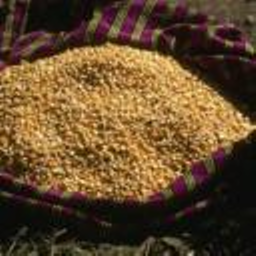
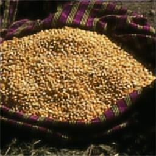

# 📕 **Introduction**

基于pytorch实现的[ESPCN](https://arxiv.org/pdf/1609.05158.pdf)(Efficient Sub-Pixel Convolutional Neural Network)

* Dataset: [BSDS300](https://www2.eecs.berkeley.edu/Research/Projects/CS/vision/grouping/segbench/BSDS300-images.tgz) (Train: 180, Validation: 20, Test: 100)

* Preprocessing:  `transforms.Resize(crop_size//2)`

* Architecture of entire network

  ```python
  self.conv1 = nn.Conv2d(in_channels, 64, kernel_size=5, padding=5//2)
  self.conv2 = nn.Conv2d(64, 32, kernel_size=3, padding=3//2)
  self.conv3 = nn.Conv2d(32, in_channels*(2**2), kernel_size=3, padding=3//2)
  self.pixel_shuffle = nn.PixelShuffle(2)
  ```


## 🤔 How To Run

1. Install the [requirement](https://raw.githubusercontent.com/Lin-CX/deep-learning/main/requirements_dl.txt) packages of this project.
2. `git clone https://github.com/Lin-CX/espcn`
3. `python3 espcn.py`

You can set the parameter as follow:

* `is_training`  ? training : not training


## Some Screenshots

### 🎈 Running:


### 🎈 Result:

|          Input          |          Bicubic          |
| :---------------------: | :-----------------------: |
|    |  |
|         Output          |           Label           |
|  |      |

